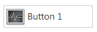

.. ModernUI_Button:

===============
ModernUI_Button
===============

A button control that allows for a lot of customization visually and in behaviour.

--------------------------
ModernUI_Button Functions
--------------------------

.. toctree::
   
   MUIButtonRegister
   MUIButtonCreate
   MUIButtonSetProperty
   MUIButtonGetProperty
   MUIButtonSetAllProperties
   MUIButtonGetState
   MUIButtonSetState
   MUIButtonLoadImages
   MUIButtonSetImages
   MUIButtonNotifySetText
   MUIButtonNotifyLoadImage
   MUIButtonNotifySetImage
   MUIButtonNotifySetFont
   MUIButtonNotify
   MUIButtonNoteSetText
   MUIButtonNoteSetFont

--------------------------
ModernUI_Button Messages
--------------------------

+--------------------------------+--------------------------+--------------------------+--------------------------+
| **Message**                    | **wParam**               | **lParam**               | **Returns**              |
+--------------------------------+--------------------------+--------------------------+--------------------------+
| MUIBM_GETSTATE                 | NULL                     | NULL                     | bState                   |
+--------------------------------+--------------------------+--------------------------+--------------------------+
| MUIBM_SETSTATE                 | bState                   | NULL                     | None                     |
+--------------------------------+--------------------------+--------------------------+--------------------------+
| MUIBM_NOTIFYSETTEXT            | lpszNotifyText           | bRedraw                  | Bool                     |
+--------------------------------+--------------------------+--------------------------+--------------------------+
| MUIBM_NOTIFYSETIMAGE           | dwImageType              | hImage                   | Bool                     |
+--------------------------------+--------------------------+--------------------------+--------------------------+
| MUIBM_NOTIFYLOADIMAGE          | dwImageType              | ResourceID               | Bool                     |
+--------------------------------+--------------------------+--------------------------+--------------------------+
| MUIBM_NOTIFYSETFONT            | hFont                    | bRedraw                  | None                     |
+--------------------------------+--------------------------+--------------------------+--------------------------+
| MUIBM_NOTIFY                   | bNotify                  | NULL                     | None                     |
+--------------------------------+--------------------------+--------------------------+--------------------------+
| MUIBM_NOTESETTEXT              | lpszNoteText             | bRedraw                  | None                     |
+--------------------------------+--------------------------+--------------------------+--------------------------+
| MUIBM_NOTESETFONT              | hFont                    | bRedraw                  | None                     |
+--------------------------------+--------------------------+--------------------------+--------------------------+

--------------------------
ModernUI_Button Properties
--------------------------

+--------------------------------+--------------------------+----------------------------------------------------------------------+
| **Property**                   | **Type**                 | **Notes**                                                            |
+--------------------------------+--------------------------+----------------------------------------------------------------------+
| ButtonTextFont                 | HFONT                    |                                                                      |
+--------------------------------+--------------------------+----------------------------------------------------------------------+
| ButtonTextColor                | COLORREF                 |                                                                      |
+--------------------------------+--------------------------+----------------------------------------------------------------------+
| ButtonTextColorAlt             | COLORREF                 |                                                                      |
+--------------------------------+--------------------------+----------------------------------------------------------------------+
| ButtonTextColorSel             | COLORREF                 |                                                                      |
+--------------------------------+--------------------------+----------------------------------------------------------------------+
| ButtonTextColorSelAlt          | COLORREF                 |                                                                      |
+--------------------------------+--------------------------+----------------------------------------------------------------------+
| ButtonTextColorDisabled        | COLORREF                 |                                                                      |
+--------------------------------+--------------------------+----------------------------------------------------------------------+
| ButtonBackColor                | COLORREF                 | -1 = transparent                                                     |
+--------------------------------+--------------------------+----------------------------------------------------------------------+
| ButtonBackColorAlt             | COLORREF                 |                                                                      |
+--------------------------------+--------------------------+----------------------------------------------------------------------+
| ButtonBackColorSel             | COLORREF                 |                                                                      |
+--------------------------------+--------------------------+----------------------------------------------------------------------+
| ButtonBackColorSelAlt          | COLORREF                 |                                                                      |
+--------------------------------+--------------------------+----------------------------------------------------------------------+
| ButtonBackColorDisabled        | COLORREF                 |                                                                      |
+--------------------------------+--------------------------+----------------------------------------------------------------------+
| ButtonBorderColor              | COLORREF                 | -1 = transparent                                                     |
+--------------------------------+--------------------------+----------------------------------------------------------------------+
| ButtonBorderColorAlt           | COLORREF                 |                                                                      |
+--------------------------------+--------------------------+----------------------------------------------------------------------+
| ButtonBorderColorSel           | COLORREF                 |                                                                      |
+--------------------------------+--------------------------+----------------------------------------------------------------------+
| ButtonBorderColorSelAlt        | COLORREF                 |                                                                      |
+--------------------------------+--------------------------+----------------------------------------------------------------------+
| ButtonBorderColorDisabled      | COLORREF                 |                                                                      |
+--------------------------------+--------------------------+----------------------------------------------------------------------+
| ButtonBorderStyle              | DWORD                    | Button Border Styles                                                 |
+--------------------------------+--------------------------+----------------------------------------------------------------------+
| ButtonAccentColor              | COLORREF                 | -1 = transparent                                                     |
+--------------------------------+--------------------------+----------------------------------------------------------------------+
| ButtonAccentColorAlt           | COLORREF                 |                                                                      |
+--------------------------------+--------------------------+----------------------------------------------------------------------+
| ButtonAccentColorSel           | COLORREF                 |                                                                      |
+--------------------------------+--------------------------+----------------------------------------------------------------------+
| ButtonAccentColorSelAlt        | COLORREF                 |                                                                      |
+--------------------------------+--------------------------+----------------------------------------------------------------------+
| ButtonAccentStyle              | DWORD                    | Button Accent Styles                                                 |
+--------------------------------+--------------------------+----------------------------------------------------------------------+
| ButtonAccentStyleAlt           | DWORD                    | Button Accent Styles                                                 |
+--------------------------------+--------------------------+----------------------------------------------------------------------+
| ButtonAccentStyleSel           | DWORD                    | Button Accent Styles                                                 |
+--------------------------------+--------------------------+----------------------------------------------------------------------+
| ButtonAccentStyleSelAlt        | DWORD                    | Button Accent Styles                                                 |
+--------------------------------+--------------------------+----------------------------------------------------------------------+
| ButtonImageType                | DWORD                    | Button Image Types                                                   |
+--------------------------------+--------------------------+----------------------------------------------------------------------+
| ButtonImage                    | hImage                   |                                                                      |
+--------------------------------+--------------------------+----------------------------------------------------------------------+
| ButtonImageAlt                 | hImage                   |                                                                      |
+--------------------------------+--------------------------+----------------------------------------------------------------------+
| ButtonImageSel                 | hImage                   |                                                                      |
+--------------------------------+--------------------------+----------------------------------------------------------------------+
| ButtonImageSelAlt              | hImage                   |                                                                      |
+--------------------------------+--------------------------+----------------------------------------------------------------------+
| ButtonImageDisabled            | hImage                   |                                                                      |
+--------------------------------+--------------------------+----------------------------------------------------------------------+
| ButtonRightImage               | hImage                   | Right side image                                                     |
+--------------------------------+--------------------------+----------------------------------------------------------------------+
| ButtonRightImageAlt            | hImage                   | Right side image                                                     |
+--------------------------------+--------------------------+----------------------------------------------------------------------+
| ButtonRightImageSel            | hImage                   | Right side image                                                     |
+--------------------------------+--------------------------+----------------------------------------------------------------------+
| ButtonRightImageSelAlt         | hImage                   | Right side image                                                     |
+--------------------------------+--------------------------+----------------------------------------------------------------------+
| ButtonRightImageDisabled       | hImage                   | Right side image                                                     |
+--------------------------------+--------------------------+----------------------------------------------------------------------+
| ButtonNotifyTextFont           | HFONT                    |                                                                      |
+--------------------------------+--------------------------+----------------------------------------------------------------------+
| ButtonNotifyTextColor          | COLORREF                 |                                                                      |
+--------------------------------+--------------------------+----------------------------------------------------------------------+
| ButtonNotifyBackColor          | COLORREF                 |                                                                      |
+--------------------------------+--------------------------+----------------------------------------------------------------------+
| ButtonNotifyRound              | DWORD                    | dwPixels - Roundrect x,y value                                       |
+--------------------------------+--------------------------+----------------------------------------------------------------------+
| ButtonNotifyImageType          | DWORD                    | Button Image Types                                                   |
+--------------------------------+--------------------------+----------------------------------------------------------------------+
| ButtonNotifyImage              | hImage                   |                                                                      |
+--------------------------------+--------------------------+----------------------------------------------------------------------+
| ButtonNoteTextFont             | HFONT                    |                                                                      |
+--------------------------------+--------------------------+----------------------------------------------------------------------+
| ButtonNoteTextColor            | COLORREF                 |                                                                      |
+--------------------------------+--------------------------+----------------------------------------------------------------------+
| ButtonNoteTextColorDisabled    | COLORREF                 |                                                                      |
+--------------------------------+--------------------------+----------------------------------------------------------------------+
| ButtonPaddingLeftIndent        | DWORD                    | dwPixels - No of pixels to indent images + text (or just text        |
+--------------------------------+--------------------------+----------------------------------------------------------------------+
| ButtonPaddingGeneral           | DWORD                    | dwPixels - No of pixels of padding to apply (Default 4px).           |
+--------------------------------+--------------------------+----------------------------------------------------------------------+
| ButtonPaddingStyle             | Button                   | Padding Style                                                        |
+--------------------------------+--------------------------+----------------------------------------------------------------------+
| ButtonPaddingTextImage         | DWORD                    | dwPixels - No of pixels between left images and text. (Default 8px)  |
+--------------------------------+--------------------------+----------------------------------------------------------------------+
| ButtonDllInstance              | DWORD                    | Set to hInstance of dll if loading images                            |
+--------------------------------+--------------------------+----------------------------------------------------------------------+
| ButtonParam                    | DWORD                    | Custom user data                                                     |
+--------------------------------+--------------------------+----------------------------------------------------------------------+

