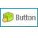

.. _ModernUI_Button:

===============
ModernUI_Button
===============

The ModernUI_Button is a button control like the standard win32 button control, except it provides ease of use and more customizable features, like color of text, background, border, accent and colors for when the mouse moves over the control, or the control is in a selected state.

Additionally images: icon, bitmap or png types, can be assigned to the ModernUI_Button control via the properties or by using one of the provided ModernUI_Button functions.

--------------------------
ModernUI_Button Functions
--------------------------

.. toctree::
   :hidden:
   :glob:
   
   MUIButton*

+-------------------------------------------------------------+-------------------------------------------------------------+
| **Function**                                                | **Description**                                             |
+-------------------------------------------------------------+-------------------------------------------------------------+
| :ref:`MUIButtonCreate<MUIButtonCreate>`                     | Creates a new ModernUI_Button control                       |
+-------------------------------------------------------------+-------------------------------------------------------------+
| :ref:`MUIButtonGetProperty<MUIButtonGetProperty>`           | Gets the value of a property                                |
+-------------------------------------------------------------+-------------------------------------------------------------+
| :ref:`MUIButtonGetState<MUIButtonGetState>`                 | Gets the current state: selected, unselected                |
+-------------------------------------------------------------+-------------------------------------------------------------+
| :ref:`MUIButtonLoadImages<MUIButtonLoadImages>`             | Load images from resources and assign to the control        |
+-------------------------------------------------------------+-------------------------------------------------------------+
| :ref:`MUIButtonNoteSetFont<MUIButtonNoteSetFont>`           | *Depreciated*                                               |
+-------------------------------------------------------------+-------------------------------------------------------------+
| :ref:`MUIButtonNoteSetText<MUIButtonNoteSetText>`           | *Depreciated*                                               |
+-------------------------------------------------------------+-------------------------------------------------------------+
| :ref:`MUIButtonNotify<MUIButtonNotify>`                     | *Depreciated*                                               |
+-------------------------------------------------------------+-------------------------------------------------------------+
| :ref:`MUIButtonNotifyLoadImage<MUIButtonNotifyLoadImage>`   | *Depreciated*                                               |
+-------------------------------------------------------------+-------------------------------------------------------------+
| :ref:`MUIButtonNotifySetFont<MUIButtonNotifySetFont>`       | *Depreciated*                                               |
+-------------------------------------------------------------+-------------------------------------------------------------+
| :ref:`MUIButtonNotifySetImage<MUIButtonNotifySetImage>`     | *Depreciated*                                               |
+-------------------------------------------------------------+-------------------------------------------------------------+
| :ref:`MUIButtonNotifySetText<MUIButtonNotifySetText>`       | *Depreciated*                                               |
+-------------------------------------------------------------+-------------------------------------------------------------+
| :ref:`MUIButtonRegister<MUIButtonRegister>`                 | Registers a window class for the ModernUI_Button            |
+-------------------------------------------------------------+-------------------------------------------------------------+
| :ref:`MUIButtonSetAllProperties<MUIButtonSetAllProperties>` | Sets all properties in one function using a structure       |
+-------------------------------------------------------------+-------------------------------------------------------------+
| :ref:`MUIButtonSetImages<MUIButtonSetImages>`               | Assigns images (previously loaded) to the control           |
+-------------------------------------------------------------+-------------------------------------------------------------+
| :ref:`MUIButtonSetProperty<MUIButtonSetProperty>`           | Sets the value of a property                                |
+-------------------------------------------------------------+-------------------------------------------------------------+
| :ref:`MUIButtonSetState<MUIButtonSetState>`                 | Sets the state: selected, unselected                        |
+-------------------------------------------------------------+-------------------------------------------------------------+

--------------------------
ModernUI_Button Messages
--------------------------

+--------------------------------+-------------------------------------------------------------+
| **Message**                    | **Description**                                             |
+--------------------------------+-------------------------------------------------------------+
| MUIBM_GETSTATE                 | Gets the current state: selected, unselected                |
+--------------------------------+-------------------------------------------------------------+
| MUIBM_SETSTATE                 | Sets the state: selected, unselected                        |
+--------------------------------+-------------------------------------------------------------+
| MUIBM_NOTIFYSETTEXT            | *Depreciated*                                               |
+--------------------------------+-------------------------------------------------------------+
| MUIBM_NOTIFYSETIMAGE           | *Depreciated*                                               |
+--------------------------------+-------------------------------------------------------------+
| MUIBM_NOTIFYLOADIMAGE          | *Depreciated*                                               |
+--------------------------------+-------------------------------------------------------------+
| MUIBM_NOTIFYSETFONT            | *Depreciated*                                               |
+--------------------------------+-------------------------------------------------------------+
| MUIBM_NOTIFY                   | *Depreciated*                                               |
+--------------------------------+-------------------------------------------------------------+
| MUIBM_NOTESETTEXT              | *Depreciated*                                               |
+--------------------------------+-------------------------------------------------------------+
| MUIBM_NOTESETFONT              | *Depreciated*                                               |
+--------------------------------+-------------------------------------------------------------+

.. _ModernUI_Button Properties:

--------------------------
ModernUI_Button Properties
--------------------------

+--------------------------------+--------------------------+----------------------------------------------------------------------+
| **Property**                   | **Type**                 | **Notes**                                                            |
+--------------------------------+--------------------------+----------------------------------------------------------------------+
| ButtonTextFont                 | HFONT                    |                                                                      |
+--------------------------------+--------------------------+----------------------------------------------------------------------+
| ButtonTextColor                | COLORREF                 |                                                                      |
+--------------------------------+--------------------------+----------------------------------------------------------------------+
| ButtonTextColorAlt             | COLORREF                 |                                                                      |
+--------------------------------+--------------------------+----------------------------------------------------------------------+
| ButtonTextColorSel             | COLORREF                 |                                                                      |
+--------------------------------+--------------------------+----------------------------------------------------------------------+
| ButtonTextColorSelAlt          | COLORREF                 |                                                                      |
+--------------------------------+--------------------------+----------------------------------------------------------------------+
| ButtonTextColorDisabled        | COLORREF                 |                                                                      |
+--------------------------------+--------------------------+----------------------------------------------------------------------+
| ButtonBackColor                | COLORREF                 | -1 = transparent                                                     |
+--------------------------------+--------------------------+----------------------------------------------------------------------+
| ButtonBackColorAlt             | COLORREF                 |                                                                      |
+--------------------------------+--------------------------+----------------------------------------------------------------------+
| ButtonBackColorSel             | COLORREF                 |                                                                      |
+--------------------------------+--------------------------+----------------------------------------------------------------------+
| ButtonBackColorSelAlt          | COLORREF                 |                                                                      |
+--------------------------------+--------------------------+----------------------------------------------------------------------+
| ButtonBackColorDisabled        | COLORREF                 |                                                                      |
+--------------------------------+--------------------------+----------------------------------------------------------------------+
| ButtonBorderColor              | COLORREF                 | -1 = transparent                                                     |
+--------------------------------+--------------------------+----------------------------------------------------------------------+
| ButtonBorderColorAlt           | COLORREF                 |                                                                      |
+--------------------------------+--------------------------+----------------------------------------------------------------------+
| ButtonBorderColorSel           | COLORREF                 |                                                                      |
+--------------------------------+--------------------------+----------------------------------------------------------------------+
| ButtonBorderColorSelAlt        | COLORREF                 |                                                                      |
+--------------------------------+--------------------------+----------------------------------------------------------------------+
| ButtonBorderColorDisabled      | COLORREF                 |                                                                      |
+--------------------------------+--------------------------+----------------------------------------------------------------------+
| ButtonBorderStyle              | DWORD                    | Button Border Styles                                                 |
+--------------------------------+--------------------------+----------------------------------------------------------------------+
| ButtonAccentColor              | COLORREF                 | -1 = transparent                                                     |
+--------------------------------+--------------------------+----------------------------------------------------------------------+
| ButtonAccentColorAlt           | COLORREF                 |                                                                      |
+--------------------------------+--------------------------+----------------------------------------------------------------------+
| ButtonAccentColorSel           | COLORREF                 |                                                                      |
+--------------------------------+--------------------------+----------------------------------------------------------------------+
| ButtonAccentColorSelAlt        | COLORREF                 |                                                                      |
+--------------------------------+--------------------------+----------------------------------------------------------------------+
| ButtonAccentStyle              | DWORD                    | Button Accent Styles                                                 |
+--------------------------------+--------------------------+----------------------------------------------------------------------+
| ButtonAccentStyleAlt           | DWORD                    | Button Accent Styles                                                 |
+--------------------------------+--------------------------+----------------------------------------------------------------------+
| ButtonAccentStyleSel           | DWORD                    | Button Accent Styles                                                 |
+--------------------------------+--------------------------+----------------------------------------------------------------------+
| ButtonAccentStyleSelAlt        | DWORD                    | Button Accent Styles                                                 |
+--------------------------------+--------------------------+----------------------------------------------------------------------+
| ButtonImageType                | DWORD                    | Button Image Types                                                   |
+--------------------------------+--------------------------+----------------------------------------------------------------------+
| ButtonImage                    | hImage                   |                                                                      |
+--------------------------------+--------------------------+----------------------------------------------------------------------+
| ButtonImageAlt                 | hImage                   |                                                                      |
+--------------------------------+--------------------------+----------------------------------------------------------------------+
| ButtonImageSel                 | hImage                   |                                                                      |
+--------------------------------+--------------------------+----------------------------------------------------------------------+
| ButtonImageSelAlt              | hImage                   |                                                                      |
+--------------------------------+--------------------------+----------------------------------------------------------------------+
| ButtonImageDisabled            | hImage                   |                                                                      |
+--------------------------------+--------------------------+----------------------------------------------------------------------+
| ButtonRightImage               | hImage                   | Right side image                                                     |
+--------------------------------+--------------------------+----------------------------------------------------------------------+
| ButtonRightImageAlt            | hImage                   | Right side image                                                     |
+--------------------------------+--------------------------+----------------------------------------------------------------------+
| ButtonRightImageSel            | hImage                   | Right side image                                                     |
+--------------------------------+--------------------------+----------------------------------------------------------------------+
| ButtonRightImageSelAlt         | hImage                   | Right side image                                                     |
+--------------------------------+--------------------------+----------------------------------------------------------------------+
| ButtonRightImageDisabled       | hImage                   | Right side image                                                     |
+--------------------------------+--------------------------+----------------------------------------------------------------------+
| ButtonNotifyTextFont           | HFONT                    |                                                                      |
+--------------------------------+--------------------------+----------------------------------------------------------------------+
| ButtonNotifyTextColor          | COLORREF                 |                                                                      |
+--------------------------------+--------------------------+----------------------------------------------------------------------+
| ButtonNotifyBackColor          | COLORREF                 |                                                                      |
+--------------------------------+--------------------------+----------------------------------------------------------------------+
| ButtonNotifyRound              | DWORD                    | dwPixels - Roundrect x,y value                                       |
+--------------------------------+--------------------------+----------------------------------------------------------------------+
| ButtonNotifyImageType          | DWORD                    | Button Image Types                                                   |
+--------------------------------+--------------------------+----------------------------------------------------------------------+
| ButtonNotifyImage              | hImage                   |                                                                      |
+--------------------------------+--------------------------+----------------------------------------------------------------------+
| ButtonNoteTextFont             | HFONT                    |                                                                      |
+--------------------------------+--------------------------+----------------------------------------------------------------------+
| ButtonNoteTextColor            | COLORREF                 |                                                                      |
+--------------------------------+--------------------------+----------------------------------------------------------------------+
| ButtonNoteTextColorDisabled    | COLORREF                 |                                                                      |
+--------------------------------+--------------------------+----------------------------------------------------------------------+
| ButtonPaddingLeftIndent        | DWORD                    | dwPixels - No of pixels to indent images + text (or just text        |
+--------------------------------+--------------------------+----------------------------------------------------------------------+
| ButtonPaddingGeneral           | DWORD                    | dwPixels - No of pixels of padding to apply (Default 4px).           |
+--------------------------------+--------------------------+----------------------------------------------------------------------+
| ButtonPaddingStyle             | Button                   | Padding Style                                                        |
+--------------------------------+--------------------------+----------------------------------------------------------------------+
| ButtonPaddingTextImage         | DWORD                    | dwPixels - No of pixels between left images and text. (Default 8px)  |
+--------------------------------+--------------------------+----------------------------------------------------------------------+
| ButtonDllInstance              | DWORD                    | Set to hInstance of dll if loading images                            |
+--------------------------------+--------------------------+----------------------------------------------------------------------+
| ButtonParam                    | DWORD                    | Custom user data                                                     |
+--------------------------------+--------------------------+----------------------------------------------------------------------+

