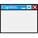

.. _ModernUI_CaptionBar:

====================
ModernUI_CaptionBar
====================

The ModernUI_CaptionBar is a control set at the top of your window / dialog, that comprises of a rectangle containing the caption text or title of the window / dialog, along with one or more system buttons. System buttons are typically minimize, maximize, restore and close.

The ModernUI_CaptionBar control is automatically aligned to the top of the window dialog, and spans the width of it. The control will automatically adjust the width when the window / dialog is resized, via the system buttons (min/max/restore), double clicking the caption bar itself (toggles between maximized and restored) or programmatically via ShowWindow or other win32 api calls.

------------------------------
ModernUI_CaptionBar Functions
------------------------------

.. toctree::
   :glob:
   
   MUICap*

-----------------------------
ModernUI_CaptionBar Messages
-----------------------------

-------------------------------
ModernUI_CaptionBar Properties
-------------------------------