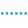

.. _ModernUI_ProgressDots:

=====================
ModernUI_ProgressDots
=====================

The ModernUI_ProgressDots is a control similar to a progress bar, but features small dots that travel horizontally across the screen, and the dots vary in speed at which they travel depending on their location. They can be seen to slow down in the middle third of the screen, and speed up at the beginning and end thirds. Typically this type of control is used to indicate progress of an indeterminate length of time.

-------------------------------
ModernUI_ProgressDots Functions
-------------------------------

.. toctree::
   :glob:
   
   MUIProgressDots*

------------------------------
ModernUI_ProgressDots Messages
------------------------------

--------------------------------
ModernUI_ProgressDots Properties
--------------------------------
