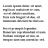

.. _ModernUI_Text:

====================
ModernUI_Text
====================

The ModernUI_Text is a static display of text. However it provides ease of use and customizable features like a small set of font families (Arial, Courier New, Segoe UI, Tahoma, Times New Roman and Verdana), font size (7pt-32pt), font effects (like bold, italic, underline), text color, back color and more.

These features allow you set the desired font style and size just with a few style flags when creating the ModernUI_Text control. Colors and other properites can be set at run time, without having to write extra code to handle WM_CTLCOLORSTATIC and/or creating fonts to assign to the control.

------------------------------
ModernUI_Text Functions
------------------------------

.. toctree::
   :hidden:
   :glob:
   
   MUIText*

+-------------------------------------------------------------+-------------------------------------------------------------+
| **Function**                                                | **Description**                                             |
+-------------------------------------------------------------+-------------------------------------------------------------+
| :ref:`MUITextCreate<MUITextCreate>`                         | Creates a new ModernUI_Text control                         |
+-------------------------------------------------------------+-------------------------------------------------------------+
| :ref:`MUITextGetProperty<MUITextGetProperty>`               | Gets the value of a property                                |
+-------------------------------------------------------------+-------------------------------------------------------------+
| :ref:`MUITextRegister<MUITextRegister>`                     | Registers a window class for the ModernUI_Text              |
+-------------------------------------------------------------+-------------------------------------------------------------+
| :ref:`MUITextSetBufferSize<MUITextSetBufferSize>`           | Sets internal buffer size for text strings                  |
+-------------------------------------------------------------+-------------------------------------------------------------+
| :ref:`MUITextSetProperty<MUITextSetProperty>`               | Sets the value of a property                                |
+-------------------------------------------------------------+-------------------------------------------------------------+

.. _ModernUI_Text Properties:

-------------------------------
ModernUI_Text Properties
-------------------------------

+-------------------------------------------------------------------+--------------------------+
| **Property**                                                      | **Type**                 |
+-------------------------------------------------------------------+--------------------------+
| :ref:`@TextFont<TextFontProperty>`                                | ``HFONT``                |
+-------------------------------------------------------------------+--------------------------+
| :ref:`@TextColor<TextColorProperty>`                              | ``MUICOLORRGB``          |
+-------------------------------------------------------------------+--------------------------+
| :ref:`@TextColorAlt<TextColorAltProperty>`                        | ``MUICOLORRGB``          |
+-------------------------------------------------------------------+--------------------------+
| :ref:`@TextColorDisabled<TextColorDisabledProperty>`              | ``MUICOLORRGB``          |
+-------------------------------------------------------------------+--------------------------+
| :ref:`@TextBackColor<TextBackColorProperty>`                      | ``MUICOLORRGB``          |
+-------------------------------------------------------------------+--------------------------+
| :ref:`@TextBackColorAlt<TextBackColorAltProperty>`                | ``MUICOLORRGB``          |
+-------------------------------------------------------------------+--------------------------+
| :ref:`@TextBackColorDisabled<TextBackColorDisabledProperty>`      | ``MUICOLORRGB``          |
+-------------------------------------------------------------------+--------------------------+

ModernUI_Text Property Descriptions
-----------------------------------

.. _TextFontProperty:

**@TextFont**

Font used for ModernUI_Text control text

.. _TextColorProperty:

**@TextColor**
   
Text color (:ref:`MUICOLORRGB<MUICOLORRGB>`) of the ModernUI_Text control

.. _TextColorAltProperty:

**@TextColorAlt**

Text color (:ref:`MUICOLORRGB<MUICOLORRGB>`) when mouse moves over ModernUI_Text control

.. _TextColorDisabledProperty:

**@TextColorDisabled**

Text color (:ref:`MUICOLORRGB<MUICOLORRGB>`) when ModernUI_Text control is disabled

.. _TextBackColorProperty:

**@TextBackColor**

Background (:ref:`MUICOLORRGB<MUICOLORRGB>`) color of the ModernUI_Text control. For transparency use ``-1``

.. _TextBackColorAltProperty:

**@TextBackColorAlt**

Background (:ref:`MUICOLORRGB<MUICOLORRGB>`) color when mouse moves over ModernUI_Text control

.. _TextBackColorDisabledProperty:

**@TextBackColorDisabled**

Background (:ref:`MUICOLORRGB<MUICOLORRGB>`) color when ModernUI_Text control is disabled

